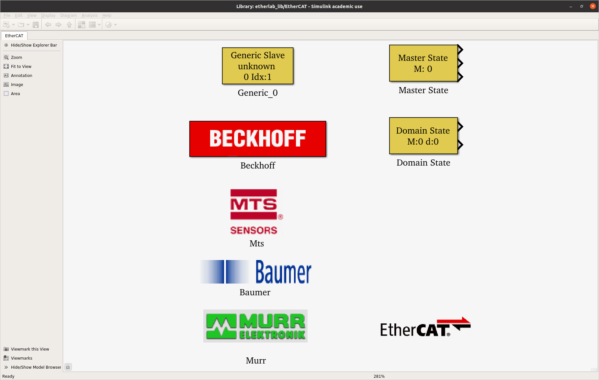
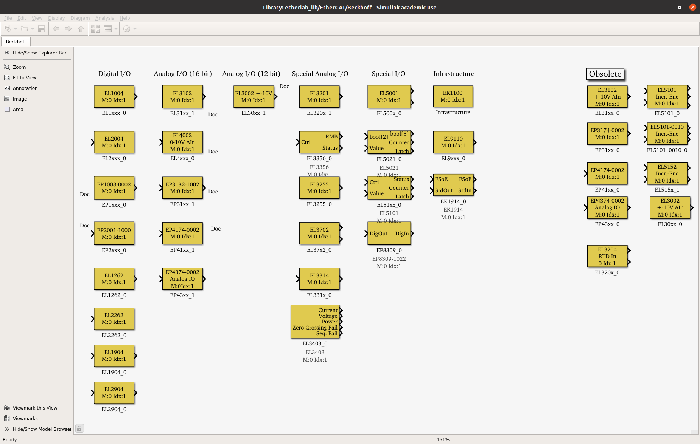
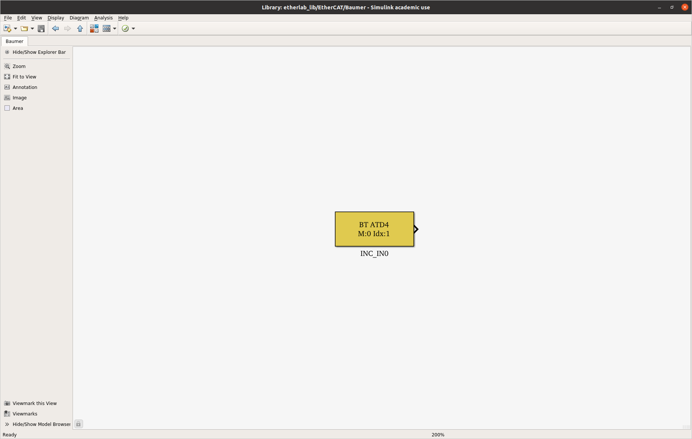
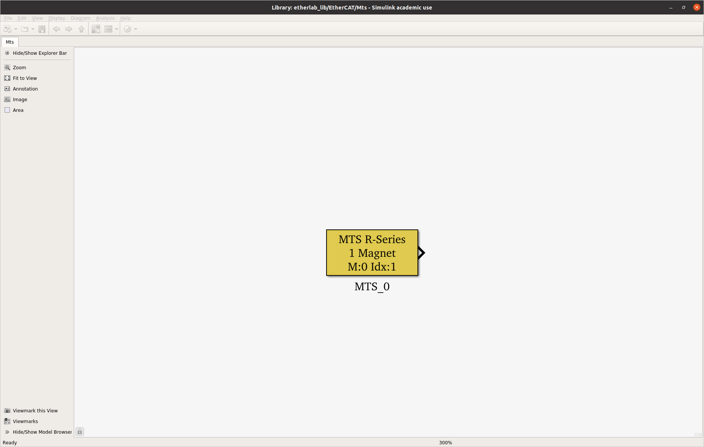
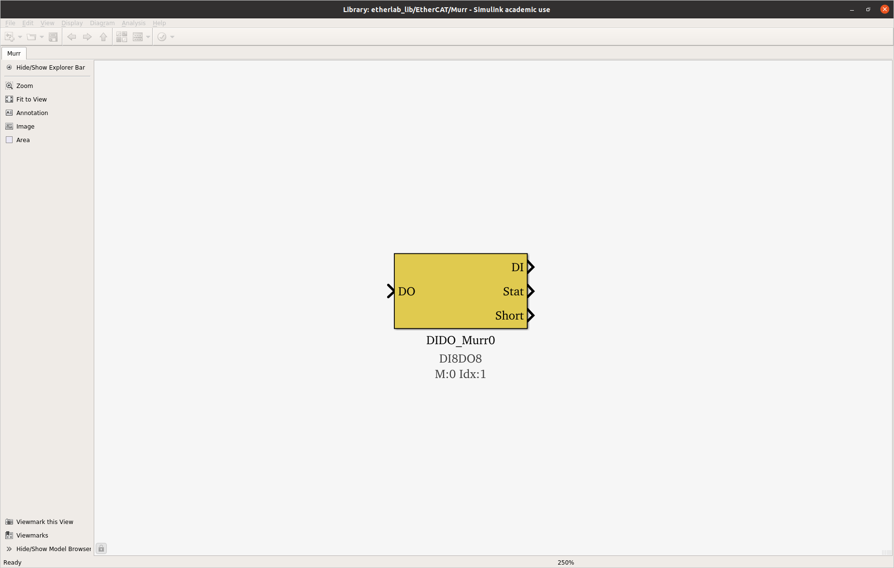

# EtherLab Beispiele

Dieses Verzeichnis enthält Simulink-Modelle (`.mdl`) und MATLAB-Skripte (`.m`) für die Ansteuerung verschiedener EtherCAT-Geräte mit EtherLab.

## Übersicht der Dateien

Die Dateien sind nach den entsprechenden EtherCAT-Klemmen oder Geräten benannt.

### Beckhoff Klemmen

*   **EL3104 - Analoge Eingangsklemme**
    *   `EL3104.mdl`: Simulink-Modell zur Erfassung von analogen Eingangssignalen.

*   **EL3702 - Analoge Eingangsklemme**
    *   `EL3702.mdl`: Simulink-Modell für schnelle, analoge Datenerfassung.

*   **EL4102 - Analoge Ausgangsklemme**
    *   `EL4102.mdl`: Simulink-Modell zur Ausgabe von analogen Signalen.

*   **EL5101 - Inkremental-Encoder-Interface**
    *   `EL5101.m`: MATLAB-Skript zur Konfiguration und Ansteuerung des Encoder-Interface.
    *   `EL5101.mdl`: Simulink-Modell zur Auswertung von Encoder-Signalen.

*   **EL7211 / EL7221 - Servomotor-Klemmen**
    *   `EL7211_stromregelung.m`: MATLAB-Skript für eine Stromregelung.
    *   `EL7211_positionsregelung.m`: MATLAB-Skript für eine Positionsregelung.
    *   `EL7211.mdl`: Simulink-Modell für die Ansteuerung der EL7211.
    *   `EL7221.m` & `EL7221.mdl`: Skript und Modell für die Ansteuerung der EL7221.

### Weitere Geräte

*   **IMU EtherCAT Shield**
    *   `imu_EtherCAT_shield.m`: MATLAB-Skript zur Ansteuerung des IMU-Shields.
    *   `imu_EtherCAT_shield.mdl`: Simulink-Modell zur Erfassung der IMU-Daten.

*   **Maxon Motor**
    *   `Maxon.m`: MATLAB-Skript für die Ansteuerung eines Maxon-Motors.
    *   `Maxon.mdl`: Simulink-Modell für die Ansteuerung eines Maxon-Motors.

*   **Kollmorgen S600 Servo-Verstärker**
    *   `S600_geschwindigkeitsregelung.m`: MATLAB-Skript für eine Geschwindigkeitsregelung.
    *   `S600_stromregelung.m`: MATLAB-Skript für eine Stromregelung.
    *   `S600_stromregelung.mdl`: Simulink-Modell für eine Stromregelung.

## Bibliotheken

Wenn man `etherlab_lib` in die MATLAB-Kommandozeile eingibt, erhält man Zugriff auf die EtherLab-Bibliothek in Simulink. Die folgenden Bilder zeigen die Blöcke für die jeweiligen Hersteller:

| Hersteller | Bibliothek |
| :--- | :--- |
| **Allgemein** |  |
| **Beckhoff** |  |
| **Baumer** |  |
| **MTS** |  |
| **Murr** |  |

## Verwendung

Die `.mdl`-Dateien sind Simulink-Modelle, die für die Echtzeit-Ansteuerung über EtherLab und die `.m`-Dateien konfiguriert sind.
